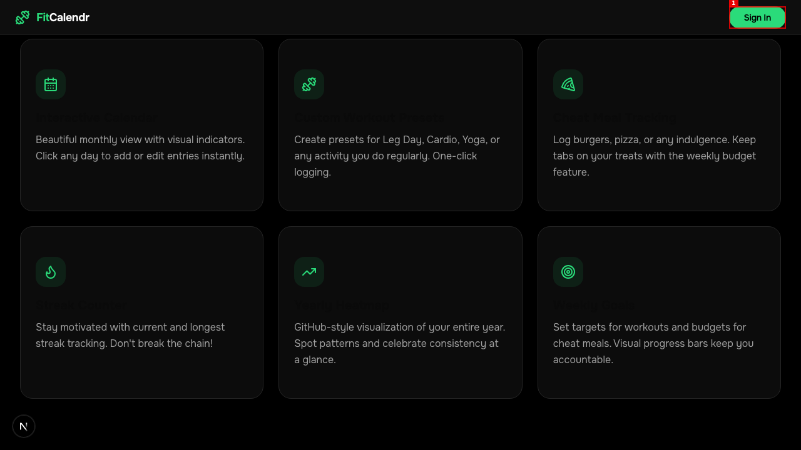
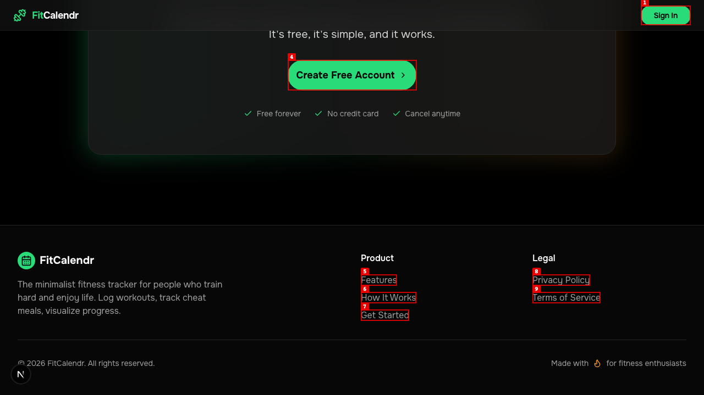
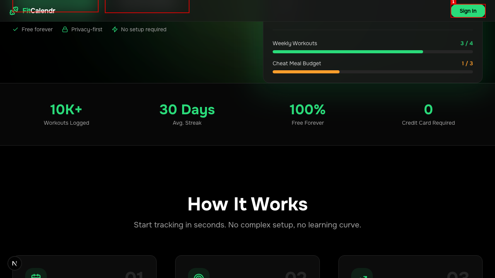
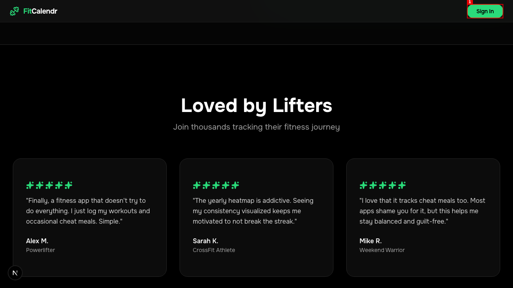
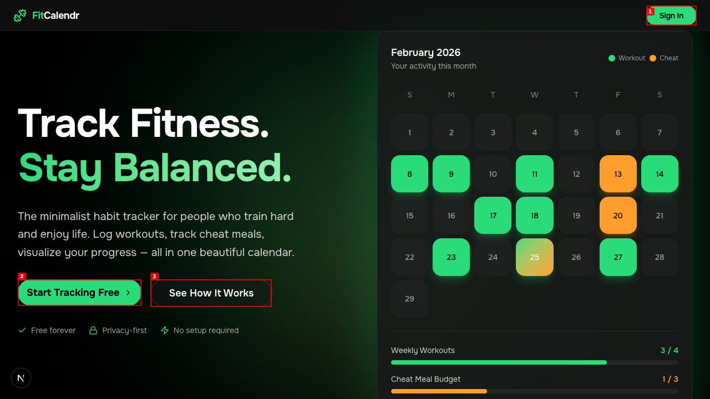
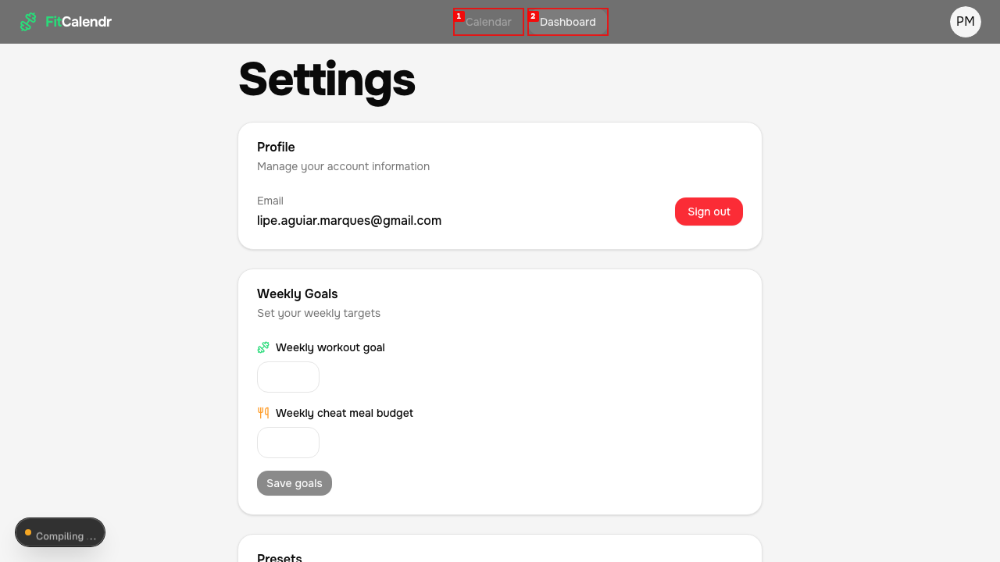
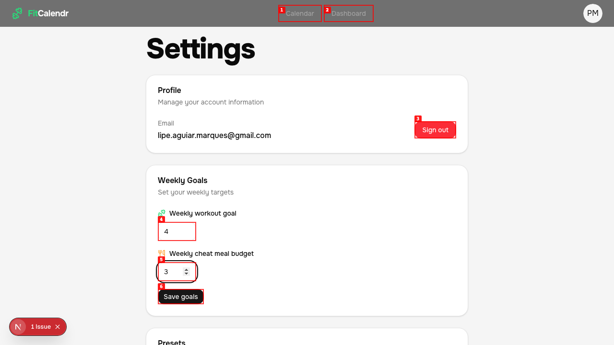
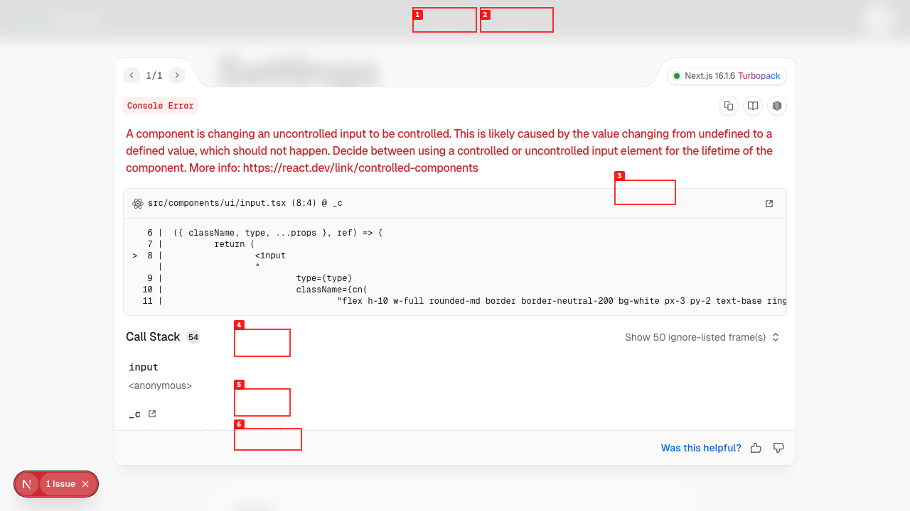

# Dogfood Report: Fit Calendr

| Field | Value |
|-------|-------|
| **Date** | 2026-02-25 |
| **App URL** | http://localhost:3000 |
| **Session** | fit-calendr |
| **Scope** | Full app (landing, auth, calendar, dashboard, settings) |

## Summary

| Severity | Count |
|----------|-------|
| Critical | 1 |
| High | 2 |
| Medium | 2 |
| Low | 2 |
| **Total** | **7** |

## Issues

---

### ISSUE-001: Feature cards missing titles

| Field | Value |
|-------|-------|
| **Severity** | medium |
| **Category** | visual |
| **URL** | http://localhost:3000/#features |
| **Repro Video** | N/A |

**Description**

All 6 feature cards in the "Everything You Need" section are missing their title/heading text. Each card shows only an icon and a description paragraph — the card titles (e.g. "Calendar View", "Activity Presets", "Cheat Meal Tracking", etc.) are completely absent, leaving a large empty gap between the icon and the description body.

**Repro Steps**

1. Navigate to http://localhost:3000 and scroll down past "How It Works" to the "Everything You Need" section.
   

2. **Observe:** All 6 cards have icons and description text but no visible heading/title above the description.

---

### ISSUE-002: Privacy Policy and Terms of Service links return 404

| Field | Value |
|-------|-------|
| **Severity** | high |
| **Category** | functional |
| **URL** | http://localhost:3000 (footer) |
| **Repro Video** | N/A |

**Description**

Both legal links in the footer ("Privacy Policy" and "Terms of Service") navigate to pages that return a Next.js 404 "This page could not be found." error. Users clicking these links before signing up will hit a dead end with no way back (the 404 page has no navigation).

**Repro Steps**

1. Navigate to http://localhost:3000 and scroll to the footer.
   

2. Click "Privacy Policy".
   

3. **Observe:** 404 error page. Same result for "Terms of Service" at `/terms-of-service`.
   

---

### ISSUE-003: Stats bar shows "0 Credit Card Required" — confusing copy

| Field | Value |
|-------|-------|
| **Severity** | medium |
| **Category** | content |
| **URL** | http://localhost:3000 |
| **Repro Video** | N/A |

**Description**

The social proof stats strip shows four metrics: "10K+ Workouts Logged", "30 Days Avg. Streak", "100% Free Forever", and "**0 Credit Card Required**". The last stat reads as a number/label pair where `0` is the number and "Credit Card Required" is the label — which a user could misread as "zero cards required" (ambiguous) or as a negative statement. The intent is clearly "No Credit Card Required" but the current layout mimics the other stats (number + descriptor), so it comes across as a design/copy mismatch.

**Repro Steps**

1. Navigate to http://localhost:3000 and scroll just below the hero section to the stats strip.
   

2. **Observe:** The fourth stat reads "0 / Credit Card Required" where `0` is styled as the large green metric number and "Credit Card Required" is the grey label beneath — inconsistent with the intended message of "No credit card required."

---

### ISSUE-004: Star ratings in testimonials render as green puzzle-piece icons

| Field | Value |
|-------|-------|
| **Severity** | low |
| **Category** | visual |
| **URL** | http://localhost:3000/#testimonials |
| **Repro Video** | N/A |

**Description**

The 5-star ratings in the "Loved by Lifters" testimonial cards are rendering as green puzzle-piece/jigsaw icons (🧩) instead of stars (⭐). This appears to be an emoji font rendering or icon substitution issue. All three testimonial cards are affected.

**Repro Steps**

1. Navigate to http://localhost:3000 and scroll to the "Loved by Lifters" testimonials section.
   

2. **Observe:** Each review shows 5 small green puzzle-piece icons where 5-star ratings are expected.

---

### ISSUE-005: Sign-in page uses light theme — breaks visual consistency

| Field | Value |
|-------|-------|
| **Severity** | low |
| **Category** | visual |
| **URL** | http://localhost:3000/sign-in |
| **Repro Video** | N/A |

**Description**

The sign-in page renders with a light grey background and black text, while the entire landing page and app use a dark theme (black background, white/green text). This creates a jarring visual discontinuity when a user clicks "Sign In" or any CTA button.

**Repro Steps**

1. Navigate to http://localhost:3000 (dark theme landing page).
   

2. Click "Sign In" in the top-right corner.
   

3. **Observe:** The sign-in page has a light background and dark text, completely different from the app's dark visual language.

---

### ISSUE-006: Direct URL navigation to /calendar and /dashboard returns 404

| Field | Value |
|-------|-------|
| **Severity** | critical |
| **Category** | functional |
| **URL** | http://localhost:3000/calendar, http://localhost:3000/dashboard |
| **Repro Video** | N/A |

**Description**

Navigating directly to `/calendar` or `/dashboard` by URL (e.g. typing in address bar, bookmarking, or sharing a link) returns a Next.js 404 "This page could not be found." error. The pages only work via in-app client-side navigation (clicking the nav links). This means users cannot bookmark or share direct links to core app pages, and any direct navigation (e.g. after copy-pasting a URL) lands on a dead-end 404.

**Repro Steps**

1. While logged in, navigate directly to http://localhost:3000/calendar.
   

2. **Observe:** 404 error. Same result for http://localhost:3000/dashboard.
   

3. Note: clicking the "Calendar" link from within the app works fine — the issue is direct URL access only.

---

### ISSUE-007: Weekly Goals inputs trigger React "uncontrolled → controlled" console error

| Field | Value |
|-------|-------|
| **Severity** | high |
| **Category** | console |
| **URL** | Settings page |
| **Repro Video** | N/A |

**Description**

When typing into the "Weekly workout goal" or "Weekly cheat meal budget" spinbuttons in Settings, a React console error fires: _"A component is changing an uncontrolled input to be controlled. This is likely caused by the value changing from `undefined` to a defined value, which should not happen."_ The error is surfaced in the Next.js dev overlay (bottom-left badge) and indicates the input components are not initialized with a default value. This can cause subtle state bugs — e.g., the inputs start empty with no placeholder or default, making it unclear what the current saved goal is.

**Repro Steps**

1. Navigate to Settings (click PM avatar → Settings).
   

2. Click into "Weekly workout goal" and type a number. The "1 Issue" badge appears in the bottom-left.
   

3. Click the "1 Issue" badge to expand it.
   

4. **Observe:** React error: "A component is changing an uncontrolled input to be controlled." Origin: `src/components/ui/input.tsx (8:4)`.

---
